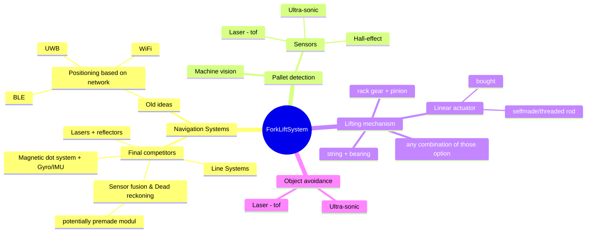

```mermaid
mindmap
  root((ForkLiftSystem))
    Navigation Systems
      Final competitors
        Line Systems
        Magnetic dot system + Gyro/IMU
        Sensor fusion & Dead reckoning
            potentially premade modul
        Lasers + reflectors
      Old ideas
        Positioning based on network
            BLE
            UWB
            WiFi
    Pallet detection
      Machine vision
      Sensors
        Hall-effect
        Laser - tof
        Ultra-sonic
    Lifting mechanism
        Linear actuator
            bought
            selfmade/threaded rod
        string + bearing
        rack gear + pinion
        any combination of those option

    Object avoidance
        Ultra-sonic
        Laser - tof
    
```