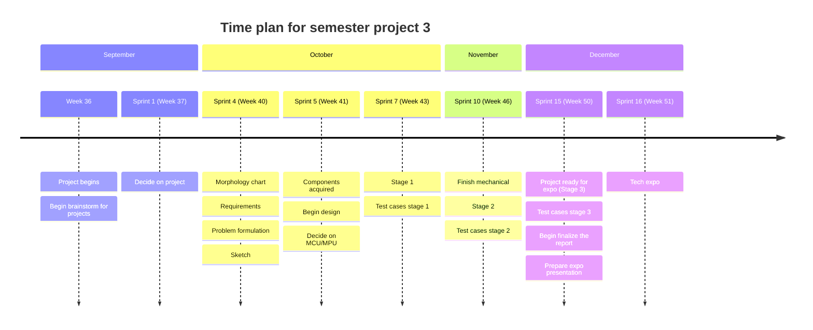

```mermaid
timeline
    title Time plan for semester project 3
    section September
        Week 36  : Project begins
            : Begin brainstorm for projects
        Sprint 1 (Week 37) : Decide on project
    section October
        Sprint 4 (Week 40) : Morphology chart
            : Requirements
            : Problem formulation
            : Sketch
        Sprint 5 (Week 41) : Components acquired
                            : Begin design
                            : Decide on MCU/MPU
        Sprint 7 (Week 43) : Stage 1
                            : Test cases stage 1
    section November
        Sprint 10 (Week 46) : Finish mechanical
             : Stage 2
             : Test cases stage 2
    section December
        Sprint 15 (Week 50) : Project ready for expo (Stage 3)
            : Test cases stage 3
             : Begin finalize the report
             : Prepare expo presentation
        Sprint 16 (Week 51) : Tech expo
```